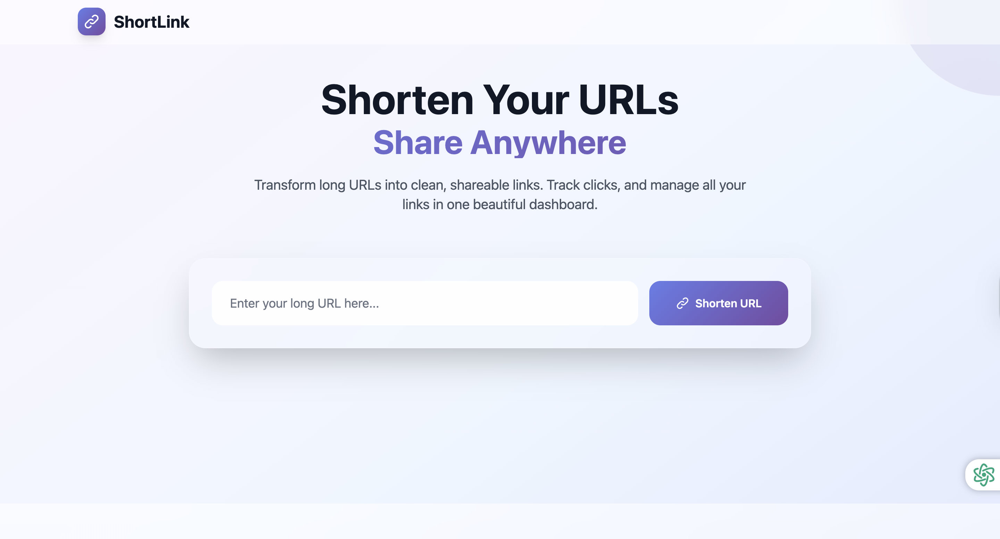

# ShortLink - URL Shortener

A simple, full-stack URL shortener built with Node.js, Express, TypeScript, MongoDB, and EJS. Instantly create, share, and manage short links with a beautiful UI.

## Features

- Shorten long URLs to clean, shareable links
- Redirect to original URLs using short codes
- Delete short URLs
- Track click counts (in database)
- Responsive, modern UI with Tailwind CSS and EJS
- RESTful API endpoints
- MongoDB for persistent storage
- Ready for deployment on Vercel

## Demo



## Getting Started

### 1. Clone the repository

```sh
git clone https://github.com/chaurasiapk/url-shortner.git
cd url-shortner
```

### 2. Install dependencies

```sh
npm install
```

### 3. Configure environment variables

Copy `.env.sample` to `.env` and fill in your MongoDB URI:

```sh
cp .env.sample .env
```

Edit `.env`:

```
PORT=8000
MONGO_URI=mongodb+srv://<DB_USERNAME>:<DB_PASSWORD>@cluster-1.cpjqsno.mongodb.net/
```

### 4. Build and run the project

#### For development (with hot reload):

```sh
npm run dev
```

#### For production:

```sh
npm run build
npm start
```

The app will be running at [http://localhost:8000](http://localhost:8000) (or your configured port).

## API Endpoints

| Method | Endpoint                 | Description              |
| ------ | ------------------------ | ------------------------ |
| POST   | `/api/shorten`           | Create a short URL       |
| GET    | `/:shortCode`            | Redirect to original URL |
| DELETE | `/api/remove/:shortCode` | Delete a short URL       |

### Example: Shorten a URL

```sh
curl -X POST http://localhost:8000/api/shorten \
  -H "Content-Type: application/json" \
  -d '{"originalUrl": "https://example.com"}'
```

**Response:**

```json
{ "shortUrl": "http://localhost:8000/abc123" }
```

## Project Structure

```
.env
.env.sample
package.json
Readme.md
tsconfig.json
vercel.json
src/
  app.ts
  index.ts
  controllers/
    url.controllers.ts
  db/
    index.ts
  models/
    url.model.ts
  routes/
    url.routes.ts
  views/
    index.ejs
```

## Deployment

This project is ready for [Vercel](vercel.json) deployment.

## License

ISC

---

Made with ❤️ by [Pradeep Chaurasia](https://github.com/chaurasiapk)
